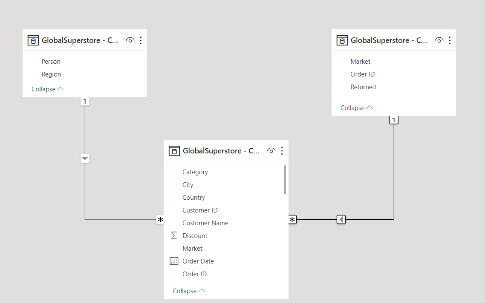

# GLOBAL SUPERSTORE ANALYSIS

## Introduction
This data analytical report explores the Global Superstore dataset to demonstrate skills in PowerQuery, Data Modeling, Data Cleaning, Data Visualization, and the generation of actionable insights with Power BI tool. The report addresses seven key questions, providing insights into the performance of the Global Superstore in various regions and aspects of its business operations in order to improve performance and profitability. 

## Problem Statement
Global Superstore, a retail organization, is seeking to gain actionable insights from its sales and profitability data in order to make informed business decisions. This report aims to answer specific questions related to profit, product performance, shipping costs, and customer behavior. 

1.  What are the three countries that generated the highest total profit for Global Superstore in 2014?, and for each of these three countries, find the three products with the highest total profit. Specifically, what are the products’ names and the total profit for each product?
2.  Identify the 3 subcategories with the highest average shipping cost in the United States.
3.  Assess Nigeria’s profitability (i.e., total profit) for 2014. How does it compare to other African countries?, what factors might be responsible for Nigeria’s poor performance?
4.  Identify the product subcategory that is the least profitable in Southeast Asia. Is there a specific country in Southeast Asia where Global Superstore should stop offering the subcategory.
5.   Which city is the least profitable (in terms of average profit) in the United States? For this analysis, discard the cities with less than 10 Orders. b) Why is this city’s average profit so low?
6.  Which product subcategory has the highest average profit in Australia?
7.  Who are the most valuable customers and what do they purchase?

## Skills/ Concepts Demostrated
The following Power BI features were incorporated:
- DAX,
- Quick measures
- Modeling
- Filters
- Visualization

## Data Sourcing 
The dataset used in this analysis is the Global Superstore dataset, provided by Digitaley Drive Data Bootcamp organized as an Excel file which contains information on sales, profit, shipping costs, and customer details. The data spans multiple years and regions. The datasets contain three (3) tables.
- ORDERS table contains 51290 rows and 24 columns
- PEOPLES table contains 13 rows and 2 columns
- RETURNS table contains 1173 rows and 3 columns

## Data Transformation 
Before analysis, the dataset was transformed to ensure data quality and relevance. This included handling missing values, correcting data types, and creating calculated fields where necessary:
- The column “Postal_code” was deleted from the ORDERS table because it contained 80% null values.
- The data types for “Sales”, “Quantity”, “Profit”, “Shipping_cost” was changed from whole number to Currency (Fixed decimal number).
- Used first row as headers for PEOPLES and RETURNS table
- Filtered rows to remove Empty rows for PEOPLES table
- Created a column “Order_year” in ORDERS table using year() function
- Removed duplicate of “Order_id” in RETURNS table leaving 1172 row from 1173 rows
The data was efficiently cleaned using Power Query Editor :

|  Peoples table            |  Orders table        |  Returned table  |
|---------------------------|----------------------|------------------|
|     |        |    |       

## Data Modeling
Hierarchical relational data model was created between the “ORDERS” table and “PEOPLES” table and also between “ORDERS” table and “RETURNS” table, with both having many to one cardinality, :memo: *this is called a star schema model*. This was done in order to improve the data quality, enable better documentation and improve application quality.

---

## Analysis And Visualization
**Three Highest Profit-Generating Countries in 2014** 

---
*To identify the three countries that generated the highest total profit for Global Superstore in 2014, a stacked bar chart was created with the help of filtering the data for the year 2014. The top three countries by total profit were found to be*: 
- United States 
- India 
- China 

### Three Most Profitable Products in Each of the Top Three Countries
To find the three products with the highest total profit in each of these three countries, stacked bar chart was created filtering each country separately to aggregate product-level profit. The results are as follows: 
- United States: 
1.  Canon imageCLASS 2200 Advanced - Total Profit: $15,679.96
2.  Hawlett Packard Laserjet 3310 Copier - Total Profit: $3,623.94
3. GBC DocuBind TL300 Electric Binding System - Total Profit: $1,910.59 
- India: 
1.  Sauder Classic Bookcase, Traditional - Total Profit: $2,419.65 
2.  Cisco Smart Phone, with Caller ID - Total Profit: $1,609.38 
3.  Hamilton Beach Refrigerator, Red - Total Profit: $1,440.24 
- China: 
1.  Sauder Classic Bookcase, Metal - Total Profit: $1,463.07
2.  Bush Classic Bookcase, mobile - Total Profit: $1,220.52 
3.  HP Copy Machine, Colour - Total Profit: $1,196.13 

### Subcategories with Highest Average Shipping Cost in the United States

---

To identify the three subcategories with the highest average shipping cost in the United States, a stacked bar chart was created by plotting average shipping cost per subcategory with filtering the country to be the United States. The top three subcategories were found to be: 
1.  Copiers - Average Shipping Cost: $165.29 
2.  Machines - Average Shipping Cost: $132.25 
3.  Tables - Average Shipping Cost: $69.95 
 
## Nigeria's Profitability in 2014 

---

Nigeria's profitability (total profit) for 2014 was assessed using a DAX expression [*Total Profit. = CALCULATE(SUM('GlobalSuperstore - Capstone xlsx - Orders'[Profit]), FILTER('GlobalSuperstore - Capstone xlsx - Orders', 'GlobalSuperstore - Capstone xlsx - Orders'[Country] = "Nigeria" && YEAR('GlobalSuperstore - Capstone xlsx - Orders'[Order Date]) = 2014))*], and it was found to be $23.29K. To compare Nigeria's performance to other African countries, Nigeria is performing poor in respect to the other African countries.

## Factors Responsible for Nigeria's Performance
Factors potentially responsible for Nigeria's poor performance were investigated. Shipping costs and average discounts were analyzed as potential root causes. Further exploration is needed to determine the impact of these factors on profitability. 
 
## Least Profitable Product Subcategory in Southeast Asia

|  Table 1                                     |  Table 2                                        |
|----------------------------------------------|-------------------------------------------------|
||   |

**_Tables_** is the least profitable product subcategory in Southeast Asia.

### :warning: Specific Country to Stop Offering Subcategory 
Superstore should stop offering subcategory to *Thailand*, though further analysis is needed to ascertain this claim.

### Least Profitable City in the United States

---

The city with the lowest average profit (for cities with more than 10 orders) in the United States was determined using data stacked bar chart. The city is **_Lancaster_**. 

### Reasons for Low Average Profit in Lancaster

An investigation into why Lancaster's average profit is low will require additional analysis, considering factors such as market conditions, competition, and customer behavior, though, *shipping cost and discount have an inverse relationship with the average profit*.

### Highest Profitable Product Subcategory in Australia 

---
The product subcategory with the highest average profit in Australia was identified using a stacked bar chart. The subcategory is **_Tables_**. 

### Most Valuable Customers and Their Purchases

---
The 5 most valuable customers are *Tamara Chand, Raymond Buch, Sanjit Chand, Hunter Lopez, Bill Eplet* but their purchase patterns will require further data analysis, including customer segmentation and purchase history analysis. 

## Conclusion and Recommendation 

In conclusion, this report has demonstrated skills in data analysis, including **PowerQuery, Data Modeling, Data Cleaning, and Data Visualization**. Actionable insights have been generated in response to specific questions related to profit, product performance, and shipping costs. To make informed business decisions, Global Superstore should:
- :bulb: Allocate resources to promote marketing and advertisement in Southeast Asia
- :bulb: Discount should be review and strategies should be put in place to reduce the shipping cost in poor performing countries like Nigeria, Zimbabwe, Uganda and Thailand.
- :bulb: Reevaluate strategies for Discounted purchase to enhance high performance.
- :bulb: Further analysis and investigation into specific areas highlighted in this report.

---

